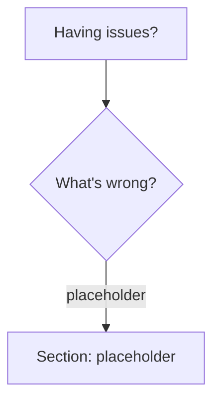

# ⚠️ Template doc: Testing disabled ⚠️

# Troubleshooting Guide

Solutions to common problems when using processor.

## Quick Diagnosis

Use this flowchart to identify your issue:



## Section 1: placeholder

### Problem: placeholder

**Symptom**: {{ cookiecutter.command_name }} placeholder

**Common causes**:

#### Cause 1: placeholder

**Diagnosis**:
```bash
placeholder
```
**Solution**: placeholder

## Getting Help

### Before Asking for Help

Gather this information:

1. **{{ cookiecutter.command_name }} version**:
   ```bash
   {{ cookiecutter.command_name }} --version
   ```

2. **Command used**:
   ```bash
   # Include full command with all options
   {{ cookiecutter.command_name }} --placeholder
   ```

3. **Sample input** (first 20 lines):
   ```bash
   head -20 your-file.log
   ```

4. **Expected vs actual output**:
   - What you expected to happen
   - What actually happened

5. **Statistics**:
   ```bash
   {{ cookiecutter.command_name }} your-file.log --stats-format json 2>&1
   ```

### Where to Get Help

- **GitHub Issues**: https://github.com/crate-ci/{{ cookiecutter.command_name }}/issues
- **Documentation**: https://docs.rs/{{ cookiecutter.command_name }}
- **Examples**: Check [Common Patterns](./common-patterns.md)

## Common Error Messages

### Error: "placeholder"

**Cause**: placeholder

**Solution**: Use placeholder

```bash
{{ cookiecutter.command_name }} --placeholder
```

## See Also

- [Common Patterns](./common-patterns.md) - Working examples for common use cases
- [Performance Guide](./performance.md) - Optimization tips
- [CLI Reference](../reference/cli.md) - Complete option documentation
